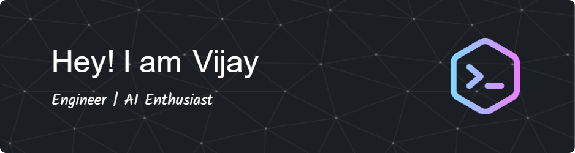

###  Hello there !
&nbsp;
&nbsp;

### 👨🏻‍💻 &nbsp;About Me

💡 &nbsp;I'm a software engineer with 4+ year's of experience, working on production of SaaS applications in Startup's and Enterprise environments. \
💻 &nbsp;I'm recently graduated MSc Computer Science at Queen Mary University of London (Sep, 2022 - Sep, 2023).\
🌱 &nbsp;I'm on track for learning more about Distributed Systems and Artificial Intelligence.\
✍️ &nbsp;In my free time, I play RPG mobile games, random walks apart from coding.\
💬 &nbsp;Feel free to reach out to me for general consulting, or discussions on the aforementioned topics!\
✉️ &nbsp;You can email me at vijaykumar4495@gmail.com. I'll try to respond as soon as possible!\
📄 &nbsp;You can check my [Resume](https://drive.google.com/file/d/10OSSrjyOuv_68zzXXWNIrm2lmZ7dMVAT/view?usp=drive_link) for more details about work experience.

### 🛠 &nbsp;Tech Stack

#### Programming / Markup Languages 

#### Libraries / Frameworks

#### Databases

#### Infrastructure and Tools 

### 📫 &nbsp; How to reach me:

 &nbsp;
 &nbsp;

<!--
**thisizvijay/thisizvijay** is a ✨ _special_ ✨ repository because its `README.md` (this file) appears on your GitHub profile.

Here are some ideas to get you started:

- 🔭 I’m currently working on ...
- 🌱 I’m currently learning ...
- 👯 I’m looking to collaborate on ...
- 🤔 I’m looking for help with ...
- 💬 Ask me about ...
- 📫 How to reach me: ...
- 😄 Pronouns: ...
- ⚡ Fun fact: ...
-->

