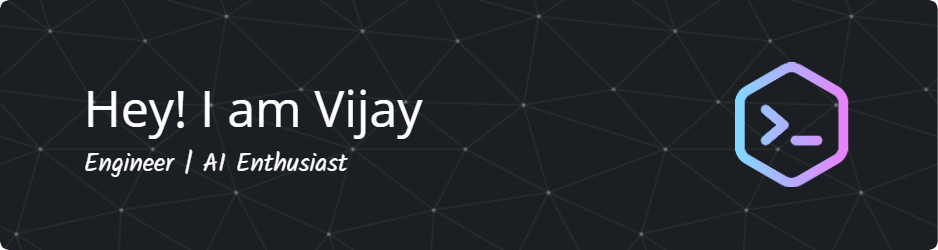

###  Hello there !
 
 

### 👨🏻‍💻  About Me

💡   I'm a software engineer, working on production of SaaS applications in Startup's and Enterprise environments. \
💻  I'm recently graduated MSc Computer Science at Queen Mary University of London.\
🌱  I'm on track for learning more about Distributed Systems and Artificial Intelligence.\
✍️  In my free time, I play RPG mobile games, random walks apart from coding.\
💬  Feel free to reach out to me for general consulting, or discussions on the aforementioned topics!\
✉️  You can email me at vijaykumar4495@gmail.com. I'll try to respond as soon as possible!\
📄  You can check my [Resume](https://drive.google.com/file/d/10OSSrjyOuv_68zzXXWNIrm2lmZ7dMVAT/view?usp=drive_link) for more details about work experience.

### 🛠  Tech Stack

 
 
 
 
\
 
 
 
 
 
 
 

### 📫   How to reach me:

 &nbsp;
 &nbsp;

<!--
**thisizvijay/thisizvijay** is a ✨ _special_ ✨ repository because its `README.md` (this file) appears on your GitHub profile.

Here are some ideas to get you started:

- 🔭 I’m currently working on ...
- 🌱 I’m currently learning ...
- 👯 I’m looking to collaborate on ...
- 🤔 I’m looking for help with ...
- 💬 Ask me about ...
- 📫 How to reach me: ...
- 😄 Pronouns: ...
- ⚡ Fun fact: ...
-->

